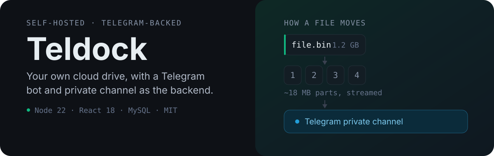
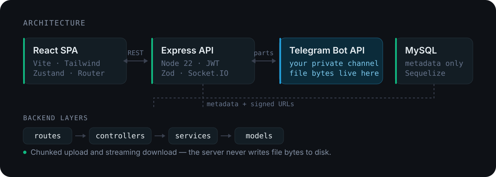

<p align="center">
  
</p>

<p align="center">
  <a href="https://github.com/Chaerulcp/Teldock/actions/workflows/ci.yml"></a>
  <a href="https://github.com/Chaerulcp/Teldock/releases"></a>
  <a href="https://chaerulcp.github.io/Teldock/"></a>
  
  
  <a href="LICENSE"></a>
</p>

**Teldock is a self-hosted cloud drive that stores your files in your own Telegram channel.** Point it at a bot you created and a private channel you own, and it becomes a browsable drive with folders, search, sharing, version history, and a WebDAV mount — while your server keeps only metadata on disk.

It is a free, open-source alternative to paying for object storage when you already have a Telegram account and a small VPS.

---

## Why the files do not live on your server

Most self-hosted drives ask you to provision a disk. Teldock inverts that: **the server never writes file bytes to disk.** It splits each upload into bounded parts, streams them to your channel, and records only the metadata needed to fetch them again.

| | |
| --- | --- |
| **Storage cost** | Your Telegram channel, not your VPS disk |
| **Bandwidth** | Served by Telegram's infrastructure |
| **Isolation** | Every account uses its own bot and channel — one instance can serve a whole household without mixing files |
| **File size** | Chunking removes the practical per-file ceiling |
| **Encryption** | Optional per-file AES-256-CTR, decided at upload time |

## Proof it works

Real response from `POST /api/files/upload` on a running instance (metadata trimmed):

```json
{
  "success": true,
  "data": {
    "file": {
      "id": "0b177935-e853-41ce-8925-f7c88feb01c3",
      "displayFilename": "teldock-testfile.txt",
      "mimeType": "application/octet-stream",
      "fileSize": 91,
      "isChunked": false,
      "partCount": 1,
      "isEncrypted": false
    }
  }
}
```

The stored bytes came back byte-identical from Telegram via `GET /api/files/s/:token?download=true`, and the test suite covers the surrounding flows:

| Suite | Command | Status |
| --- | --- | --- |
| Backend | `cd backend && npm test` | 114 passing |
| Frontend | `cd frontend && npm test` | 12 passing |
| End-to-end | `cd e2e && npm test` | 8 Playwright specs |

## How it works

<p align="center">
  
</p>

1. You connect your own **bot token** and **private channel** in Settings. The token is encrypted at rest and never returned to a client.
2. On upload, the file is split into parts of roughly **18 MB** (`TG_PART_SIZE`) to stay inside the Bot API limits.
3. Parts stream to your channel through your **bot pool**, distributed round-robin when you register more than one token.
4. MySQL stores only **metadata** — filenames, part references, sizes, and encryption parameters.
5. On download, parts are reassembled in order with HTTP `Range` support, so transfers resume and media can be seeked.

## Quick start

**Requires:** Node.js 22+, MySQL or MariaDB 8.0+, and a Telegram bot you create with [@BotFather](https://t.me/BotFather) plus a private channel. FFmpeg is optional (video previews only).

```bash
git clone https://github.com/Chaerulcp/Teldock.git
cd Teldock/backend
npm install
cp .env.example .env      # Windows PowerShell: Copy-Item .env.example .env
npm run migrate           # create the database tables
npm run dev               # API on http://localhost:3001
```

```bash
# second terminal
cd Teldock/frontend
npm install
npm run dev               # SPA on http://localhost:3000
```

Open **http://localhost:3000**, register, then connect your bot under **Settings → Telegram Integration**. The API refuses to start if `JWT_SECRET`, `REFRESH_TOKEN_SECRET`, or `ENCRYPTION_KEY` is missing or left at a placeholder — generate real values first.

Full walkthrough: **[Installation](https://chaerulcp.github.io/Teldock/guide/installation.html)** · **[Connecting Telegram](https://chaerulcp.github.io/Teldock/guide/telegram-setup.html)**

## Features

**Files and organisation**

| Feature | What it does |
| --- | --- |
| Chunked uploads | Splits large files into ~18 MB parts and streams them without buffering in memory |
| Streaming downloads | Reassembles parts with backpressure and resumable `Range` requests |
| Multi-bot pool | Several bot tokens per account, distributed round-robin for throughput |
| Version history | Overwriting snapshots the previous content; any version can be restored |
| Soft delete | Deleted files are recoverable and usage accounting stays consistent |
| Folders, tags, favourites | Hierarchical folders, user-defined tags, a favourite flag, and saved "smart folder" filters |

**Access and sharing**

| Feature | What it does |
| --- | --- |
| Public share links | Optional expiry, download limit, and password protection |
| Share page | Recipients open `/s/:token`, unlock with a password if needed, and download without an account |
| WebDAV mount | Mount the drive as an OS folder through the Rclone-compatible `/webdav` endpoint |
| Previews | In-browser image previews in several sizes, plus video thumbnails (640x360 JPEG with duration) |

## Configuration

Backend settings live in `backend/.env`. The required secrets and the values you are most likely to change:

```ini
NODE_ENV=development
PORT=3001
CORS_ORIGIN=http://localhost:3000
FRONTEND_URL=http://localhost:3000     # builds absolute share links

DB_HOST=localhost
DB_PORT=3306
DB_NAME=tele_storage_db
DB_USER=root
DB_PASSWORD=

# Required — the server refuses to boot with placeholders
JWT_SECRET=<random>
REFRESH_TOKEN_SECRET=<random>
ENCRYPTION_KEY=<random>                # changing this later makes stored credentials unreadable

FILE_ACCESS_TOKEN_EXPIRE=5m            # lifetime of signed preview/download URLs
TG_PART_SIZE=18874368                  # ~18 MB per part
MAX_UPLOAD_BYTES=2147483648            # 2 GB
WEBDAV_RATE_LIMIT_MAX=5000             # requests / 15 min on /webdav
```

Generate a secret with `node -e "console.log(require('crypto').randomBytes(48).toString('hex'))"`.

Complete reference: **[Environment variables](https://chaerulcp.github.io/Teldock/reference/configuration.html)**

## API

Base URL `http://localhost:3001/api`. Responses use `{ "success": true, "data": ... }` or `{ "success": false, "error": "..." }`; protected routes take `Authorization: Bearer <token>`.

| Area | Endpoints |
| --- | --- |
| Auth | `POST /auth/register` · `POST /auth/login` · `POST /auth/refresh` · `GET /auth/me` |
| Files | `POST /files/upload` · `GET /files` · `GET /files/search` · `PATCH /files/:id` · `DELETE /files/:id` · `POST /files/bulk` |
| Transfer | `POST /files/:id/download-url` · `GET /files/:id/download` · `POST /files/:id/preview-url` · `GET /files/:id/preview` |
| Versions | `GET /files/:id/versions` · `POST /files/:id/revert/:versionId` |
| Sharing | `POST /files/:id/share` · `GET /files/s/:token` (public) · `GET /shares` · `DELETE /shares/:id` |
| Organisation | `/folders` · `/tags` · `/smart-folders` |
| Telegram | `POST /user/telegram/connect` · `GET /user/telegram/status` · `DELETE /user/telegram/unlink` · `/bots` |
| Media | `POST /previews/generate` · `GET /stats/storage` · `GET /stats/duplicates` |
| WebDAV | `OPTIONS` `PROPFIND` `GET` `HEAD` `PUT` `DELETE` `MKCOL` `MOVE` on `/webdav/*` (HTTP Basic) |

Rate limits: 100 requests / 15 minutes globally, 20 login attempts / hour, and failed WebDAV authentication capped at 20 / 15 minutes.

Full request and response examples: **[API reference](https://chaerulcp.github.io/Teldock/reference/api.html)**

## Security

| Concern | Mechanism |
| --- | --- |
| Bot tokens | Encrypted at rest, never returned to the client |
| Passwords | bcrypt with a configurable cost factor (`BCRYPT_ROUNDS`) |
| File access | Short-lived, file-scoped signed URLs; Telegram IDs stripped from responses |
| Abuse | Global rate limiting, stricter login limits, and per-attempt WebDAV auth limits |
| Input | Zod schema validation at the route boundary; parameterised queries via Sequelize |
| Transport | Helmet Content Security Policy; run behind HTTPS in production |

Files never persist on the server disk, each user's data stays in their own channel, and there is no third-party analytics. Hardening history is tracked in **[SECURITY_CHANGES.md](SECURITY_CHANGES.md)**.

## Development

```bash
cd backend
npm run dev      # nodemon with hot reload
npm test         # Node test runner
npm run lint     # ESLint
npm run format   # Prettier
```

```bash
cd frontend
npm run dev      # Vite dev server
npm run build    # production bundle
npm test         # Vitest
```

The end-to-end suite needs a running backend and frontend plus Telegram credentials in `backend/.env`; it creates and cleans up its own fixtures.

```bash
cd e2e
npm install
npm test
```

CI runs backend lint and tests plus a frontend production build on every push to `main` and every pull request. The documentation site deploys separately.

## Project structure

```
Teldock/
├── backend/
│   ├── src/
│   │   ├── routes/         # endpoint definitions + middleware
│   │   ├── controllers/    # HTTP request/response handling
│   │   ├── services/       # Telegram gateway, chunking, streaming, previews
│   │   ├── models/         # Sequelize models
│   │   ├── middleware/     # auth, validation, file access
│   │   ├── validation/     # Zod schemas
│   │   └── config/         # database, secrets, security
│   ├── scripts/            # migrations and utilities
│   └── tests/              # Node test suite
├── frontend/src/           # pages, components, API client, stores
├── e2e/                    # Playwright suite
├── docs-site/              # VitePress documentation (EN / ID)
└── assets/readme/          # README visuals
```

The backend follows `routes → controllers → services → models`. More detail: **[Project structure](https://chaerulcp.github.io/Teldock/reference/project-structure.html)** · **[Database schema](https://chaerulcp.github.io/Teldock/reference/database-schema.html)**

## Documentation

Full documentation is published in **English and Bahasa Indonesia** at **<https://chaerulcp.github.io/Teldock/>**, covering installation, Telegram setup, configuration, usage, sharing, the multi-bot pool, WebDAV, deployment, security, the API, and troubleshooting.

The source lives in [`docs-site/`](docs-site):

```bash
cd docs-site
npm install
npm run docs:dev     # local preview
npm run docs:build   # production build
```

Additional root-level guides: [QUICK_START.md](QUICK_START.md) · [USER_GUIDE.md](USER_GUIDE.md) · [DEPLOYMENT.md](DEPLOYMENT.md) · [CONTRIBUTING.md](CONTRIBUTING.md)

## Contributing

Contributions are welcome.

- Read **[CONTRIBUTING.md](CONTRIBUTING.md)** for standards and the pull-request process.
- Report bugs or request features in **[GitHub Issues](https://github.com/Chaerulcp/Teldock/issues)**.
- Commits follow [Conventional Commits](https://www.conventionalcommits.org/); keep CI green.

## License

Licensed under the [MIT License](LICENSE).

## Disclaimer

> **Read before using.**

Teldock is a **non-commercial, open-source educational project**. Using Telegram's Bot API as general-purpose cloud storage is **not an intended use** of Telegram's platform and may violate its [Terms of Service](https://telegram.org/tos).

- Use it only with data you own or have the right to store.
- Do not use it for mass or commercial storage.
- Telegram may rate-limit, suspend, or delete abusive accounts and files.
- Keep independent backups — **do not treat Teldock as reliable primary storage.**

The authors are **not liable** for damages arising from use of this software.

## Acknowledgements

Inspired by [teldrive](https://github.com/teldrive/teldrive), a pioneering implementation of Telegram-based file hosting. Built with the Telegram Bot API, Express, React, and Sequelize.
