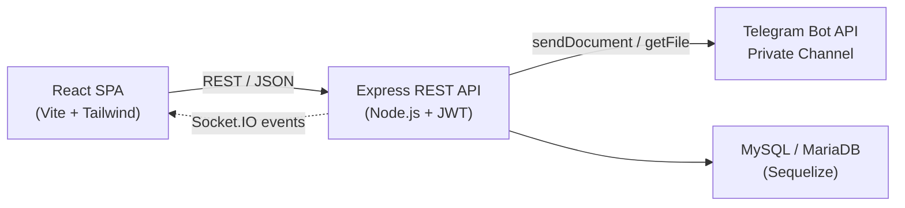

# Architecture

Teldock is split into a React single-page application and a layered Express backend. The backend owns all Telegram interaction and persists only metadata; the SPA never talks to Telegram directly.

## System overview



- The **React SPA** renders the UI and calls the REST API with a bearer access token.
- The **Express API** authenticates requests, validates input, and orchestrates storage.
- **Telegram** holds the actual file bytes, one document per part.
- **MySQL / MariaDB** stores metadata through Sequelize models.
- **Socket.IO** pushes realtime events (file changes, upload progress) back to the SPA.

## Backend layers

The backend follows a strict layered flow with clear separation of concerns:

```text
routes → controllers → services → models
```

| Layer | Responsibility |
| --- | --- |
| Routes | Define endpoints and attach authentication, validation, and file-access middleware. |
| Controllers | Handle the HTTP request/response cycle and translate service results into responses. |
| Services | Hold business logic: Telegram gateway, chunking, streaming, version history, sharing, bot pool. |
| Models | Persist and query data through Sequelize, including associations and serialization rules. |

Supporting concerns live alongside these layers: `middleware/` for auth and upload handling, `validation/` for Zod schemas, and `config/` for database and secret checks.

## Request lifecycle

### Upload

1. The SPA sends a multipart `POST /api/files/upload` with a bearer access token.
2. Route middleware authenticates the token, validates the request, and streams the upload.
3. The controller calls the upload service, which opens a database transaction and verifies the target user and folder.
4. The Telegram storage service consumes the request stream, splitting it into ~18 MB parts and hashing the plaintext incrementally.
5. If encryption is enabled, a per-file salt is generated and each part is encrypted with AES-256-CTR and a fresh IV.
6. Each part is uploaded to the user's channel via the bot pool, with retries and exponential backoff on Telegram `429` responses.
7. Metadata (file row, part rows, checksum, encryption parameters) is committed to MySQL; storage usage is updated.
8. A realtime event notifies the user's open sessions that the file has changed.

### Download

1. The SPA requests a signed URL via `POST /api/files/:id/download-url` (or uses its bearer token directly).
2. The stream service loads the file and its ordered parts and authorizes the request by owner or shared token.
3. The `Range` header is parsed into inclusive byte offsets, or the full file is selected.
4. For each overlapping part, a temporary Telegram file URL is resolved and the part is fetched, decrypted if needed, and sliced to the requested range.
5. Bytes are written to the response stream with backpressure, so a fast Telegram CDN cannot outrun a slow client.
6. The response includes `Content-Length` and, for partial requests, `Content-Range` and `206 Partial Content`.

## Data flow and storage model

| Data | Where it lives |
| --- | --- |
| File bytes | Telegram channel, as one document per part. Never on the server disk. |
| File metadata | MySQL / MariaDB: filenames, sizes, MIME types, checksums, part references. |
| Part references | `files` and `file_parts` rows holding Telegram chat, message, and file IDs. |
| Encryption parameters | Salt and per-part IV stored with the file and its parts. |
| Credentials | Bot tokens and channel IDs encrypted at rest, never returned to clients. |
| Transient data | Held in process memory (bot pool, Socket.IO). No external cache or queue. |

Chunk size is controlled by `TG_PART_SIZE` (default `18874368` bytes, about 18 MB). Uploads are bounded by `MAX_UPLOAD_BYTES` (default 2 GB). Because only one part is held in memory at a time, a multi-gigabyte upload does not inflate process memory.

::: info Internal identifiers stay server-side
Telegram chat, message, and file IDs are stripped from every serialized file before it reaches a client, so responses cannot be used to locate raw content in a channel.
:::

## Design principles

- **Streaming and chunking to bound memory** — files are never fully buffered; peak memory is roughly one part.
- **Single responsibility** — routes, controllers, services, and models each do one job, keeping functions small and testable.
- **Explicit error handling** — Telegram `429 Too Many Requests` responses are retried with exponential backoff (honoring `retry_after`), and errors are logged in detail but sanitized before reaching clients.
- **Defensive input validation** — file types, sizes, and parameters are validated at the boundary with schema validators, and file streams are protected by signed URLs.

## Related pages

- [Database Schema](/reference/database-schema) — tables, relationships, and indexes.
- [API Reference](/reference/api) — endpoints and response conventions.
- [Security](/guide/security) — protection mechanisms and data privacy.
