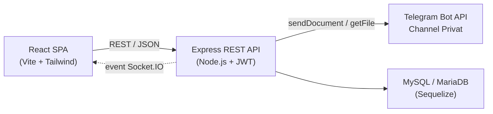

# Arsitektur

Teldock terdiri dari single-page application React dan backend Express berlapis. Backend menangani seluruh interaksi dengan Telegram dan hanya menyimpan metadata; SPA tidak pernah berkomunikasi langsung dengan Telegram.

## Gambaran sistem



- **React SPA** menampilkan antarmuka dan memanggil REST API dengan bearer access token.
- **Express API** mengautentikasi permintaan, memvalidasi input, dan mengatur penyimpanan.
- **Telegram** menyimpan byte file sebenarnya, satu dokumen per bagian.
- **MySQL / MariaDB** menyimpan metadata melalui model Sequelize.
- **Socket.IO** mendorong event realtime (perubahan file, progres upload) kembali ke SPA.

## Lapisan backend

Backend mengikuti alur berlapis yang ketat dengan pemisahan tanggung jawab yang jelas:

```text
routes → controllers → services → models
```

| Lapisan | Tanggung jawab |
| --- | --- |
| Routes | Mendefinisikan endpoint serta memasang middleware autentikasi, validasi, dan akses file. |
| Controllers | Menangani siklus permintaan/respons HTTP dan menerjemahkan hasil service menjadi respons. |
| Services | Menyimpan logika bisnis: gateway Telegram, chunking, streaming, riwayat versi, berbagi, bot pool. |
| Models | Menyimpan dan mengambil data melalui Sequelize, termasuk asosiasi dan aturan serialisasi. |

Kebutuhan pendukung berada di samping lapisan tersebut: `middleware/` untuk auth dan penanganan upload, `validation/` untuk schema Zod, serta `config/` untuk pemeriksaan database dan secret.

## Siklus hidup permintaan

### Upload

1. SPA mengirim `POST /api/files/upload` bermode multipart dengan bearer access token.
2. Middleware route mengautentikasi token, memvalidasi permintaan, dan men-stream unggahan.
3. Controller memanggil upload service, yang membuka transaksi database dan memverifikasi pengguna serta folder tujuan.
4. Telegram storage service mengonsumsi stream permintaan, memecahnya menjadi bagian sekitar 18 MB, dan menghitung hash plaintext secara inkremental.
5. Jika enkripsi diaktifkan, salt per file dibuat dan setiap bagian dienkripsi dengan AES-256-CTR serta IV baru.
6. Setiap bagian diunggah ke channel pengguna melalui bot pool, dengan percobaan ulang dan exponential backoff saat Telegram merespons `429`.
7. Metadata (baris file, baris bagian, checksum, parameter enkripsi) di-commit ke MySQL; penggunaan penyimpanan diperbarui.
8. Event realtime memberi tahu sesi pengguna yang terbuka bahwa file telah berubah.

### Unduh

1. SPA meminta signed URL melalui `POST /api/files/:id/download-url` (atau memakai bearer token secara langsung).
2. Stream service memuat file beserta bagian-bagiannya yang terurut dan mengotorisasi permintaan berdasarkan pemilik atau shared token.
3. Header `Range` diuraikan menjadi offset byte inklusif, atau seluruh file dipilih.
4. Untuk setiap bagian yang tumpang tindih, URL file Telegram sementara diselesaikan, bagian diambil, didekripsi bila perlu, lalu dipotong sesuai rentang yang diminta.
5. Byte ditulis ke stream respons dengan backpressure, sehingga CDN Telegram yang cepat tidak melampaui klien yang lambat.
6. Respons menyertakan `Content-Length` dan, untuk permintaan parsial, `Content-Range` serta `206 Partial Content`.

## Aliran data dan model penyimpanan

| Data | Lokasi penyimpanan |
| --- | --- |
| Byte file | Channel Telegram, satu dokumen per bagian. Tidak pernah di disk server. |
| Metadata file | MySQL / MariaDB: nama file, ukuran, MIME type, checksum, referensi bagian. |
| Referensi bagian | Baris `files` dan `file_parts` yang menyimpan chat, message, dan file ID Telegram. |
| Parameter enkripsi | Salt dan IV per bagian disimpan bersama file dan bagian-bagiannya. |
| Kredensial | Token bot dan ID channel terenkripsi, tidak pernah dikembalikan ke klien. |
| Data sementara | Disimpan di memori proses (bot pool, Socket.IO). Tanpa cache atau queue eksternal. |

Ukuran chunk diatur oleh `TG_PART_SIZE` (default `18874368` byte, sekitar 18 MB). Unggahan dibatasi oleh `MAX_UPLOAD_BYTES` (default 2 GB). Karena hanya satu bagian yang ditahan di memori pada satu waktu, unggahan berukuran beberapa gigabyte tidak membengkakkan memori proses.

::: info Identifier internal tetap di sisi server
Chat, message, dan file ID Telegram dihapus dari setiap file yang diserialisasi sebelum dikirim ke klien, sehingga respons tidak dapat dipakai untuk menemukan konten mentah di dalam channel.
:::

## Prinsip desain

- **Streaming dan chunking untuk membatasi memori** — file tidak pernah di-buffer sepenuhnya; memori puncak hanya sekitar satu bagian.
- **Tanggung jawab tunggal** — routes, controllers, services, dan models masing-masing mengerjakan satu tugas, sehingga fungsi tetap kecil dan mudah diuji.
- **Penanganan error yang eksplisit** — respons Telegram `429 Too Many Requests` dicoba ulang dengan exponential backoff (menghormati `retry_after`), dan error dicatat secara detail tetapi disanitasi sebelum sampai ke klien.
- **Validasi input yang defensif** — tipe file, ukuran, dan parameter divalidasi di batas API dengan schema validator, serta stream file dilindungi oleh signed URL.

## Halaman terkait

- [Skema Database](/id/reference/database-schema) — tabel, relasi, dan indeks.
- [Referensi API](/id/reference/api) — endpoint dan konvensi respons.
- [Keamanan](/id/guide/security) — mekanisme perlindungan dan privasi data.
