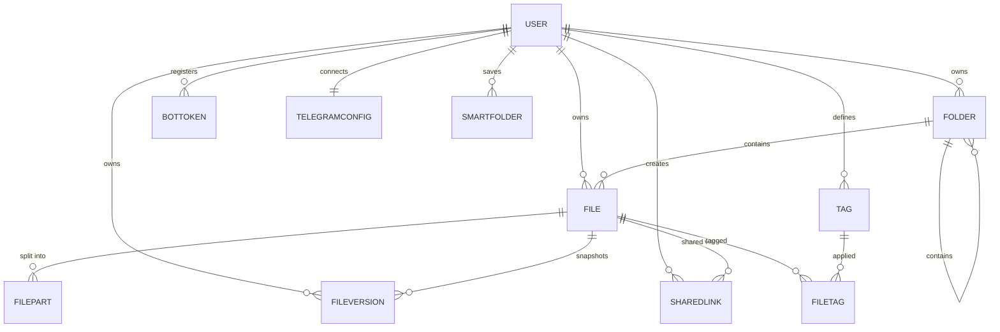

# Database Schema

Teldock menyimpan metadata di MySQL/MariaDB melalui Sequelize. Model berada di
`backend/src/models/` dan didaftarkan bersama di `backend/src/models/index.js`, yang juga
mendeklarasikan asosiasinya. Byte file mentah tidak pernah disimpan di database.

## Relasi entitas



## User

Record akun dan pemilik seluruh resource lain. Tabel: `users`.

| Kolom | Tipe | Catatan |
| --- | --- | --- |
| `id` | `UUID` | Primary key, default `UUIDV4`. |
| `telegramId` | `BIGINT` | Unik, nullable. |
| `email` | `STRING(255)` | Unik. |
| `username` | `STRING(255)` | Nullable. |
| `firstName` / `lastName` | `STRING(100)` | Nullable. |
| `avatarUrl` | `STRING(500)` | Nullable. |
| `passwordHash` | `STRING(255)` | Nullable; hash bcrypt. |
| `storageQuotaBytes` | `BIGINT` | Nullable; `NULL` berarti tanpa kuota tetap. |
| `storageUsedBytes` | `BIGINT` | Default `0`; perkiraan pemakaian untuk statistik. |
| `premiumUntil` | `DATE` | Nullable. |
| `isPremium` | `BOOLEAN` | Default `false`. |
| `isActive` | `BOOLEAN` | Default `true`. |

Indeks: `telegramId`, `email`. Method helper: `canUpload()`, `User.updateStorageUsage()`.

## BotToken

Pool bot token Telegram per pengguna untuk throughput paralel. Tabel: `bot_tokens`.

| Kolom | Tipe | Catatan |
| --- | --- | --- |
| `id` | `UUID` | Primary key. |
| `userId` | `UUID` | FK ke `users.id`, `ON DELETE CASCADE`. |
| `tokenEncrypted` | `TEXT` | Bot token terenkripsi AES-256-CBC (`iv:ciphertext`). |
| `botUsername` | `STRING(100)` | Nama tampilan. |
| `botId` | `BIGINT` | ID bot Telegram numerik. |
| `isActive` | `BOOLEAN` | Apakah bot tersedia di pool. |
| `lastUsedAt` | `DATE` | Timestamp untuk keadilan round-robin. |

Indeks: `userId`, `isActive`. `getToken()` mendekripsi nilai tersimpan saat dibutuhkan.

## File

Metadata file dan referensi Telegram. Tabel: `files`.

| Kolom | Tipe | Catatan |
| --- | --- | --- |
| `id` | `UUID` | Primary key. |
| `userId` | `UUID` | FK ke `users.id`, `ON DELETE CASCADE`. |
| `folderId` | `UUID` | FK ke `folders.id`, `ON DELETE SET NULL`. |
| `telegramChatId` | `BIGINT` | ID channel penyimpanan (tidak diekspos API). |
| `telegramMessageId` | `INTEGER` | Nullable untuk file chunked. |
| `telegramFileId` | `STRING(255)` | Nullable untuk file chunked. |
| `originalFilename` | `STRING(500)` | Nama saat diunggah. |
| `displayFilename` | `STRING(500)` | Nama yang ditampilkan di UI. |
| `mimeType` | `STRING(100)` | Tipe MIME. |
| `fileSize` | `BIGINT` | Ukuran dalam byte. |
| `isChunked` | `BOOLEAN` | Dipecah ke beberapa pesan Telegram. |
| `partCount` | `INTEGER` | Default `1`. |
| `isEncrypted` | `BOOLEAN` | Apakah part dienkripsi saat disimpan. |
| `encryptionSalt` | `STRING(64)` | Salt hex untuk key per file. |
| `checksum` | `STRING(64)` | SHA-256 dari file asli. |
| `isPublic` | `BOOLEAN` | Default `false`. |
| `isFavorite` | `BOOLEAN` | Default `false`. |
| `sharedToken` | `STRING(64)` | Unik, nullable. |
| `downloadCount` | `INTEGER` | Default `0`. |
| `lastDownloadedAt` | `DATE` | Nullable. |
| `isDeleted` | `BOOLEAN` | Flag soft delete. |
| `deletedAt` | `DATE` | Nullable. |

Indeks: `userId`, `folderId`, `idx_telegram_file` (`telegramFileId`), `idx_user_files`
(`userId`, `isDeleted`, `createdAt`), `idx_telegram_chat_msg` (`telegramChatId`,
`telegramMessageId`), unik `idx_shared_token` (`sharedToken`), dan FULLTEXT `idx_search`
(`originalFilename`, `mimeType`).

::: info
`File.toJSON()` menghapus `telegramChatId`, `telegramMessageId`, dan `telegramFileId` sehingga
identifier penyimpanan internal tidak pernah sampai ke response API.
:::

## FilePart

Satu chunk dari file besar, merujuk pada satu pesan Telegram. Tabel: `file_parts`.

| Kolom | Tipe | Catatan |
| --- | --- | --- |
| `id` | `UUID` | Primary key. |
| `fileId` | `UUID` | FK ke `files.id`, `ON DELETE CASCADE`. |
| `partIndex` | `INTEGER` | Urutan berbasis nol dalam file. |
| `telegramChatId` | `BIGINT` | Channel yang menyimpan part ini. |
| `telegramMessageId` | `INTEGER` | ID pesan part ini. |
| `telegramFileId` | `STRING(255)` | File ID Telegram part ini. |
| `partSize` | `BIGINT` | Ukuran tersimpan (ukuran terenkripsi jika dienkripsi). |
| `plainSize` | `BIGINT` | Ukuran sebelum enkripsi. |
| `encryptionIv` | `STRING(32)` | IV hex, nullable. |
| `checksum` | `STRING(64)` | SHA-256 dari plaintext part. |

Indeks: `fileId`, dan unik `idx_file_part_order` (`fileId`, `partIndex`).

## FileVersion

Snapshot immutable sebuah file untuk riwayat versi. Tabel: `file_versions`.

| Kolom | Tipe | Catatan |
| --- | --- | --- |
| `id` | `UUID` | Primary key. |
| `fileId` | `UUID` | FK ke `files.id`, `ON DELETE CASCADE`. |
| `userId` | `UUID` | FK ke `users.id`, `ON DELETE CASCADE`. |
| `versionNumber` | `INTEGER` | Berurutan (1, 2, 3...). |
| `telegramMessageId` / `telegramFileId` / `telegramChatId` | mixed | Referensi praktis untuk single-part. |
| `isChunked` | `BOOLEAN` | Default `false`. |
| `partCount` | `INTEGER` | Default `1`. |
| `isEncrypted` | `BOOLEAN` | Default `false`. |
| `encryptionSalt` | `STRING(64)` | Nullable. |
| `partsSnapshot` | `LONGTEXT` | Array JSON berisi record `FilePart` versi tersebut. |
| `originalFilename` / `displayFilename` | `STRING(500)` | Nama saat snapshot. |
| `mimeType` | `STRING(100)` | Tipe MIME. |
| `fileSize` | `BIGINT` | Ukuran dalam byte. |
| `checksum` | `STRING(64)` | Hash SHA-256. |

Indeks: `fileId`, `userId`, `versionNumber`. `getMetadata()` mengembalikan ringkasan yang dipangkas.

## FileTag

Tabel join untuk relasi many-to-many `File` ↔ `Tag`. Tabel: `file_tags`.

| Kolom | Tipe | Catatan |
| --- | --- | --- |
| `fileId` | `UUID` | FK ke `files.id`, `ON DELETE CASCADE`. |
| `tagId` | `UUID` | FK ke `tags.id`, `ON DELETE CASCADE`. |

Indeks: unik `uniq_file_tag` (`fileId`, `tagId`). Tanpa timestamp.

## Folder

Folder hierarkis milik pengguna. Tabel: `folders`.

| Kolom | Tipe | Catatan |
| --- | --- | --- |
| `id` | `UUID` | Primary key. |
| `userId` | `UUID` | FK ke `users.id`, `ON DELETE CASCADE`. |
| `parentFolderId` | `UUID` | Self-reference, `ON DELETE SET NULL`. |
| `name` | `STRING(255)` | Wajib. |
| `path` | `STRING(1000)` | Path lengkap (misalnya `/Documents/Projects`). |
| `depth` | `INTEGER` | Root bernilai `0`. |
| `displayOrder` | `INTEGER` | Urutan di dalam parent. |
| `icon` | `STRING(50)` | Default `"folder"`. |

Indeks: `userId`, `parentFolderId`, `folders_tree_index` (`userId`, `parentFolderId`,
`displayOrder`), dan unik `folders_path_idx` (`path`).

## SharedLink

Public share yang dibuat untuk sebuah file. Tabel: `shared_links`.

| Kolom | Tipe | Catatan |
| --- | --- | --- |
| `id` | `UUID` | Primary key. |
| `fileId` | `UUID` | FK ke `files.id`, `ON DELETE CASCADE`. |
| `creatorId` | `UUID` | FK ke `users.id`, `ON DELETE CASCADE`. |
| `token` | `STRING(512)` | JWT unik yang dipakai di URL share. |
| `passwordHash` | `STRING(255)` | Hash bcrypt opsional. |
| `downloadLimit` | `INTEGER` | Nullable (tanpa batas). |
| `usedDownloads` | `INTEGER` | Default `0`. |
| `expiresAt` | `DATE` | Nullable (tidak pernah kedaluwarsa). |
| `allowDownload` | `BOOLEAN` | Default `true`. |
| `allowPreview` | `BOOLEAN` | Default `true`. |
| `accessedCount` | `INTEGER` | Default `0`. |
| `lastAccessedAt` | `DATE` | Nullable. |

Indeks: `token`, `idx_expires` (`expiresAt`), `idx_file_creator` (`fileId`, `creatorId`).
`SharedLink.consumeDownload()` memesan satu download dengan satu update kondisional sehingga request
yang bersamaan tidak dapat melewati batas.

## SmartFolder

Filter file tersimpan (bukan folder sesungguhnya). Tabel: `smart_folders`.

| Kolom | Tipe | Catatan |
| --- | --- | --- |
| `id` | `UUID` | Primary key. |
| `userId` | `UUID` | FK ke `users.id`, `ON DELETE CASCADE`. |
| `name` | `STRING(80)` | Wajib. |
| `icon` | `STRING(30)` | Default `"sparkles"`. |
| `criteria` | `TEXT` | JSON: `{ favorite?, tagId?, type?, q? }`. |

Indeks: `userId`.

## Tag

Label yang ditentukan pengguna. Tabel: `tags`.

| Kolom | Tipe | Catatan |
| --- | --- | --- |
| `id` | `UUID` | Primary key. |
| `userId` | `UUID` | FK ke `users.id`, `ON DELETE CASCADE`. |
| `name` | `STRING(50)` | Wajib. |
| `color` | `STRING(20)` | Default `"#10b981"`. |

Indeks: `userId`, dan unik `uniq_user_tag` (`userId`, `name`).

## TelegramConfig

Kredensial bot dan channel penyimpanan Telegram per pengguna. Tabel: `user_telegram_configs`.

| Kolom | Tipe | Catatan |
| --- | --- | --- |
| `id` | `UUID` | Primary key. |
| `userId` | `UUID` | FK ke `users.id`, `ON DELETE CASCADE`. |
| `botTokenEncrypted` | `TEXT` | Bot token terenkripsi AES-256-CBC. |
| `storageChatId` | `STRING(50)` | ID chat/channel penyimpanan. |
| `chatType` | `ENUM('channel','group','private')` | Default `"channel"`. |
| `username` | `STRING(100)` | Nullable. |
| `isActive` | `TINYINT(1)` | Default `1`. |

Indeks: `userId`, `isActive`. `TelegramConfig.toJSON()` menghapus `botTokenEncrypted` dan
`storageChatId`; `decryptToken()` mendekripsi saat dibutuhkan.

## Model penyimpanan chunked

Bot API Telegram membatasi satu kali upload, sehingga Teldock memecah file besar menjadi part dengan
ukuran terbatas (sekitar 18 MB, diatur oleh `TG_PART_SIZE`). Setiap part diunggah sebagai pesan
Telegram tersendiri dan dicatat sebagai baris `FilePart`:

- `File.isChunked` menandai file multi-part, dan `File.partCount` mencatat jumlah part yang ada.
- Setiap `FilePart` menyimpan `partIndex`, `telegramChatId`, `telegramMessageId`, dan
  `telegramFileId` untuk chunk tersebut, plus ukurannya dan IV enkripsi opsional.
- Saat download, part dibaca kembali sesuai urutan `partIndex`, didekripsi bila perlu, lalu disatukan
  menjadi satu stream dengan dukungan HTTP `Range`.
- `FileVersion.partsSnapshot` menyimpan daftar part lengkap untuk file chunked/terenkripsi sehingga
  versi sebelumnya dapat dipulihkan secara persis.

## Migrasi

Skrip migrasi berada di `backend/scripts/` dan dijalankan dari direktori `backend`.

| Skrip | Perintah npm | Fungsi |
| --- | --- | --- |
| `migrate.js` | `npm run migrate` | Membuat/memperbarui seluruh tabel dari model. |
| `migrate-chunked-storage.js` | `npm run migrate:chunked` | Menambah kolom chunked/encrypted pada `files`. |
| `migrate-drop-quota.js` | `npm run migrate:drop-quota` | Membuat `storageQuotaBytes` nullable dan membersihkan kuota lama. |
| `migrate-widen-share-token.js` | `npm run migrate:widen-share-token` | Melebarkan `shared_links.token` menjadi `VARCHAR(512)`. |
| `migrate-version-snapshots.js` | `npm run migrate:version-snapshots` | Menambah kolom part snapshot pada `file_versions`. |
| `migrate-tags-favorites.js` | `npm run migrate:tags-favorites` | Menambah `files.isFavorite`, `tags`, `file_tags`, `smart_folders`. |

Dua skrip tambahan dijalankan langsung dengan Node saat meningkatkan database lama:
`scripts/migrate-file-versions.js` dan `scripts/migrate-telegram-configs.js`.

```bash
cd backend
npm run migrate
```

Lihat [Deployment](/id/guide/deployment) untuk menjalankan migrasi di produksi.

## Halaman terkait

- [API Reference](/id/reference/api) — bagaimana model ini muncul sebagai endpoint.
- [Project Structure](/id/reference/project-structure) — lokasi model dan migrasi.
- [Configuration](/id/reference/configuration) — variabel database dan enkripsi.
