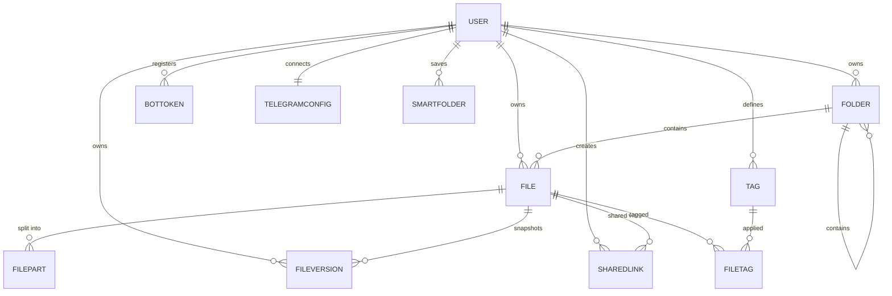

# Database Schema

Teldock stores metadata in MySQL/MariaDB through Sequelize. The models live in
`backend/src/models/` and are registered together in `backend/src/models/index.js`, which also
declares the associations. Raw file bytes are never stored in the database.

## Entity relationships



## User

Account record and owner of all other resources. Table: `users`.

| Column | Type | Notes |
| --- | --- | --- |
| `id` | `UUID` | Primary key, default `UUIDV4`. |
| `telegramId` | `BIGINT` | Unique, nullable. |
| `email` | `STRING(255)` | Unique. |
| `username` | `STRING(255)` | Nullable. |
| `firstName` / `lastName` | `STRING(100)` | Nullable. |
| `avatarUrl` | `STRING(500)` | Nullable. |
| `passwordHash` | `STRING(255)` | Nullable; bcrypt hash. |
| `storageQuotaBytes` | `BIGINT` | Nullable; `NULL` means no fixed quota. |
| `storageUsedBytes` | `BIGINT` | Default `0`; approximate usage for stats. |
| `premiumUntil` | `DATE` | Nullable. |
| `isPremium` | `BOOLEAN` | Default `false`. |
| `isActive` | `BOOLEAN` | Default `true`. |

Indexes: `telegramId`, `email`. Helper methods: `canUpload()`, `User.updateStorageUsage()`.

## BotToken

A pool of Telegram bot tokens per user for parallel throughput. Table: `bot_tokens`.

| Column | Type | Notes |
| --- | --- | --- |
| `id` | `UUID` | Primary key. |
| `userId` | `UUID` | FK to `users.id`, `ON DELETE CASCADE`. |
| `tokenEncrypted` | `TEXT` | AES-256-CBC encrypted bot token (`iv:ciphertext`). |
| `botUsername` | `STRING(100)` | Display name. |
| `botId` | `BIGINT` | Numeric Telegram bot ID. |
| `isActive` | `BOOLEAN` | Whether the bot is available in the pool. |
| `lastUsedAt` | `DATE` | Timestamp for round-robin fairness. |

Indexes: `userId`, `isActive`. `getToken()` decrypts the stored value on demand.

## File

File metadata and Telegram references. Table: `files`.

| Column | Type | Notes |
| --- | --- | --- |
| `id` | `UUID` | Primary key. |
| `userId` | `UUID` | FK to `users.id`, `ON DELETE CASCADE`. |
| `folderId` | `UUID` | FK to `folders.id`, `ON DELETE SET NULL`. |
| `telegramChatId` | `BIGINT` | Storage channel ID (not exposed by the API). |
| `telegramMessageId` | `INTEGER` | Nullable for chunked files. |
| `telegramFileId` | `STRING(255)` | Nullable for chunked files. |
| `originalFilename` | `STRING(500)` | Name at upload time. |
| `displayFilename` | `STRING(500)` | Name shown in the UI. |
| `mimeType` | `STRING(100)` | MIME type. |
| `fileSize` | `BIGINT` | Size in bytes. |
| `isChunked` | `BOOLEAN` | Split across multiple Telegram messages. |
| `partCount` | `INTEGER` | Default `1`. |
| `isEncrypted` | `BOOLEAN` | Whether parts are encrypted at rest. |
| `encryptionSalt` | `STRING(64)` | Hex salt for the per-file key. |
| `checksum` | `STRING(64)` | SHA-256 of the original file. |
| `isPublic` | `BOOLEAN` | Default `false`. |
| `isFavorite` | `BOOLEAN` | Default `false`. |
| `sharedToken` | `STRING(64)` | Unique, nullable. |
| `downloadCount` | `INTEGER` | Default `0`. |
| `lastDownloadedAt` | `DATE` | Nullable. |
| `isDeleted` | `BOOLEAN` | Soft-delete flag. |
| `deletedAt` | `DATE` | Nullable. |

Indexes: `userId`, `folderId`, `idx_telegram_file` (`telegramFileId`), `idx_user_files`
(`userId`, `isDeleted`, `createdAt`), `idx_telegram_chat_msg` (`telegramChatId`,
`telegramMessageId`), unique `idx_shared_token` (`sharedToken`), and a FULLTEXT `idx_search`
(`originalFilename`, `mimeType`).

::: info
`File.toJSON()` strips `telegramChatId`, `telegramMessageId`, and `telegramFileId` so internal
storage identifiers never reach API responses.
:::

## FilePart

One chunk of a large file, referencing a single Telegram message. Table: `file_parts`.

| Column | Type | Notes |
| --- | --- | --- |
| `id` | `UUID` | Primary key. |
| `fileId` | `UUID` | FK to `files.id`, `ON DELETE CASCADE`. |
| `partIndex` | `INTEGER` | Zero-based order within the file. |
| `telegramChatId` | `BIGINT` | Channel holding this part. |
| `telegramMessageId` | `INTEGER` | Message ID of this part. |
| `telegramFileId` | `STRING(255)` | Telegram file ID of this part. |
| `partSize` | `BIGINT` | Stored size (encrypted size if encrypted). |
| `plainSize` | `BIGINT` | Pre-encryption size. |
| `encryptionIv` | `STRING(32)` | Hex IV, nullable. |
| `checksum` | `STRING(64)` | SHA-256 of the plaintext part. |

Indexes: `fileId`, and unique `idx_file_part_order` (`fileId`, `partIndex`).

## FileVersion

Immutable snapshot of a file for version history. Table: `file_versions`.

| Column | Type | Notes |
| --- | --- | --- |
| `id` | `UUID` | Primary key. |
| `fileId` | `UUID` | FK to `files.id`, `ON DELETE CASCADE`. |
| `userId` | `UUID` | FK to `users.id`, `ON DELETE CASCADE`. |
| `versionNumber` | `INTEGER` | Sequential (1, 2, 3...). |
| `telegramMessageId` / `telegramFileId` / `telegramChatId` | mixed | Single-part convenience references. |
| `isChunked` | `BOOLEAN` | Default `false`. |
| `partCount` | `INTEGER` | Default `1`. |
| `isEncrypted` | `BOOLEAN` | Default `false`. |
| `encryptionSalt` | `STRING(64)` | Nullable. |
| `partsSnapshot` | `LONGTEXT` | JSON array of the version's `FilePart` records. |
| `originalFilename` / `displayFilename` | `STRING(500)` | Names at snapshot time. |
| `mimeType` | `STRING(100)` | MIME type. |
| `fileSize` | `BIGINT` | Size in bytes. |
| `checksum` | `STRING(64)` | SHA-256 hash. |

Indexes: `fileId`, `userId`, `versionNumber`. `getMetadata()` returns a trimmed summary.

## FileTag

Join table for the many-to-many `File` ↔ `Tag` relationship. Table: `file_tags`.

| Column | Type | Notes |
| --- | --- | --- |
| `fileId` | `UUID` | FK to `files.id`, `ON DELETE CASCADE`. |
| `tagId` | `UUID` | FK to `tags.id`, `ON DELETE CASCADE`. |

Indexes: unique `uniq_file_tag` (`fileId`, `tagId`). No timestamps.

## Folder

Hierarchical folders owned by a user. Table: `folders`.

| Column | Type | Notes |
| --- | --- | --- |
| `id` | `UUID` | Primary key. |
| `userId` | `UUID` | FK to `users.id`, `ON DELETE CASCADE`. |
| `parentFolderId` | `UUID` | Self-reference, `ON DELETE SET NULL`. |
| `name` | `STRING(255)` | Required. |
| `path` | `STRING(1000)` | Full path (for example `/Documents/Projects`). |
| `depth` | `INTEGER` | Root is `0`. |
| `displayOrder` | `INTEGER` | Sort order within the parent. |
| `icon` | `STRING(50)` | Default `"folder"`. |

Indexes: `userId`, `parentFolderId`, `folders_tree_index` (`userId`, `parentFolderId`,
`displayOrder`), and unique `folders_path_idx` (`path`).

## SharedLink

A public share created for a file. Table: `shared_links`.

| Column | Type | Notes |
| --- | --- | --- |
| `id` | `UUID` | Primary key. |
| `fileId` | `UUID` | FK to `files.id`, `ON DELETE CASCADE`. |
| `creatorId` | `UUID` | FK to `users.id`, `ON DELETE CASCADE`. |
| `token` | `STRING(512)` | Unique JWT used in the share URL. |
| `passwordHash` | `STRING(255)` | Optional bcrypt hash. |
| `downloadLimit` | `INTEGER` | Nullable (unlimited). |
| `usedDownloads` | `INTEGER` | Default `0`. |
| `expiresAt` | `DATE` | Nullable (never expires). |
| `allowDownload` | `BOOLEAN` | Default `true`. |
| `allowPreview` | `BOOLEAN` | Default `true`. |
| `accessedCount` | `INTEGER` | Default `0`. |
| `lastAccessedAt` | `DATE` | Nullable. |

Indexes: `token`, `idx_expires` (`expiresAt`), `idx_file_creator` (`fileId`, `creatorId`).
`SharedLink.consumeDownload()` reserves a download with one conditional update so concurrent
requests cannot exceed the limit.

## SmartFolder

A saved file filter (not a real folder). Table: `smart_folders`.

| Column | Type | Notes |
| --- | --- | --- |
| `id` | `UUID` | Primary key. |
| `userId` | `UUID` | FK to `users.id`, `ON DELETE CASCADE`. |
| `name` | `STRING(80)` | Required. |
| `icon` | `STRING(30)` | Default `"sparkles"`. |
| `criteria` | `TEXT` | JSON: `{ favorite?, tagId?, type?, q? }`. |

Indexes: `userId`.

## Tag

A user-defined label. Table: `tags`.

| Column | Type | Notes |
| --- | --- | --- |
| `id` | `UUID` | Primary key. |
| `userId` | `UUID` | FK to `users.id`, `ON DELETE CASCADE`. |
| `name` | `STRING(50)` | Required. |
| `color` | `STRING(20)` | Default `"#10b981"`. |

Indexes: `userId`, and unique `uniq_user_tag` (`userId`, `name`).

## TelegramConfig

Per-user Telegram bot and storage channel credentials. Table: `user_telegram_configs`.

| Column | Type | Notes |
| --- | --- | --- |
| `id` | `UUID` | Primary key. |
| `userId` | `UUID` | FK to `users.id`, `ON DELETE CASCADE`. |
| `botTokenEncrypted` | `TEXT` | AES-256-CBC encrypted bot token. |
| `storageChatId` | `STRING(50)` | Storage chat/channel ID. |
| `chatType` | `ENUM('channel','group','private')` | Default `"channel"`. |
| `username` | `STRING(100)` | Nullable. |
| `isActive` | `TINYINT(1)` | Default `1`. |

Indexes: `userId`, `isActive`. `TelegramConfig.toJSON()` strips `botTokenEncrypted` and
`storageChatId`; `decryptToken()` decrypts on demand.

## Chunked storage model

Telegram's Bot API limits a single upload, so Teldock splits larger files into bounded parts (about
18 MB, controlled by `TG_PART_SIZE`). Each part is uploaded as its own Telegram message and recorded
as a `FilePart` row:

- `File.isChunked` marks a multi-part file, and `File.partCount` records how many parts exist.
- Each `FilePart` stores the `partIndex`, the Telegram `telegramChatId`, `telegramMessageId`, and
  `telegramFileId` for that chunk, plus its size and optional encryption IV.
- On download, parts are read back in `partIndex` order, decrypted when needed, and stitched into a
  single stream with HTTP `Range` support.
- `FileVersion.partsSnapshot` preserves the full part list for chunked/encrypted files so a prior
  version can be restored exactly.

## Migrations

Migration scripts live in `backend/scripts/` and are run from the `backend` directory.

| Script | npm command | Purpose |
| --- | --- | --- |
| `migrate.js` | `npm run migrate` | Create/update all tables from the models. |
| `migrate-chunked-storage.js` | `npm run migrate:chunked` | Add chunked/encrypted columns to `files`. |
| `migrate-drop-quota.js` | `npm run migrate:drop-quota` | Make `storageQuotaBytes` nullable and clear the legacy quota. |
| `migrate-widen-share-token.js` | `npm run migrate:widen-share-token` | Widen `shared_links.token` to `VARCHAR(512)`. |
| `migrate-version-snapshots.js` | `npm run migrate:version-snapshots` | Add part-snapshot columns to `file_versions`. |
| `migrate-tags-favorites.js` | `npm run migrate:tags-favorites` | Add `files.isFavorite`, `tags`, `file_tags`, `smart_folders`. |

Two additional scripts are run directly with Node when upgrading older databases:
`scripts/migrate-file-versions.js` and `scripts/migrate-telegram-configs.js`.

```bash
cd backend
npm run migrate
```

See [Deployment](/guide/deployment) for running migrations in production.

## Related pages

- [API Reference](/reference/api) — how these models surface as endpoints.
- [Project Structure](/reference/project-structure) — where the models and migrations live.
- [Configuration](/reference/configuration) — database and encryption variables.
